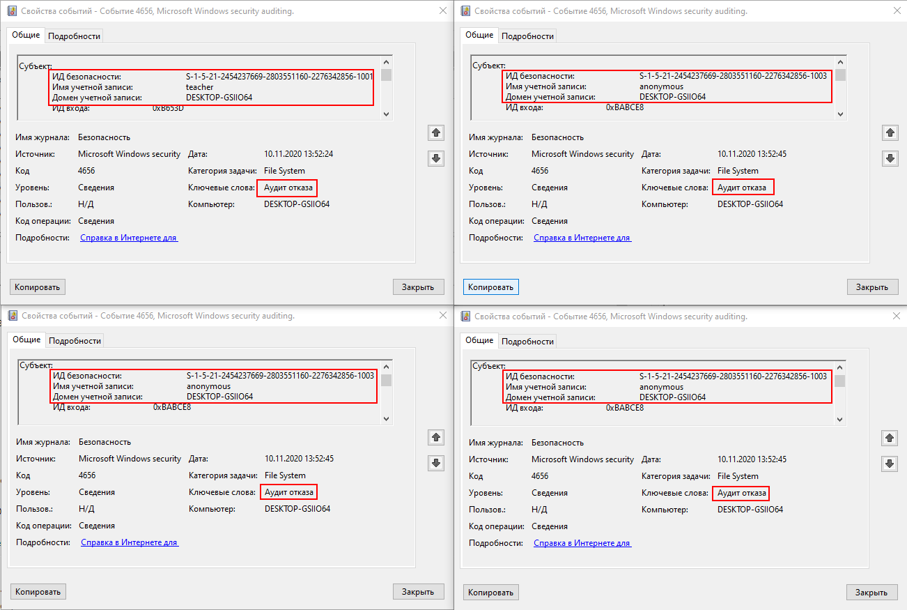
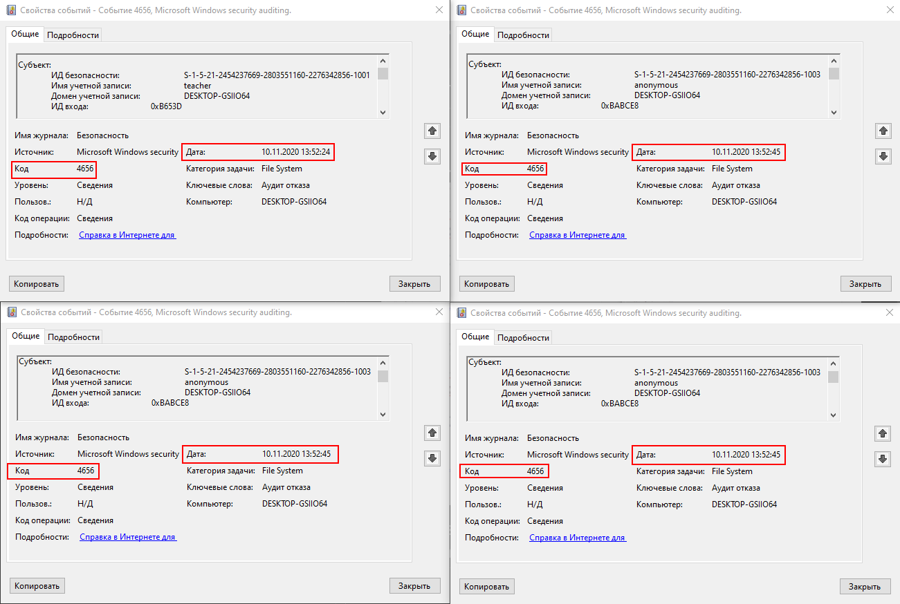
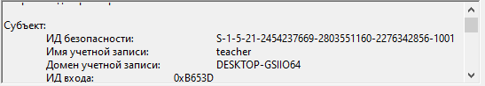
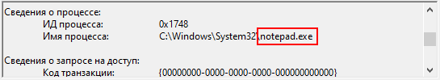
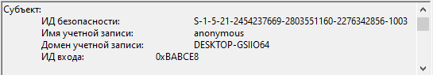
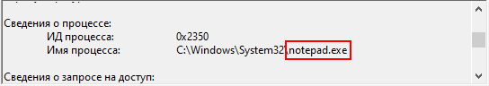
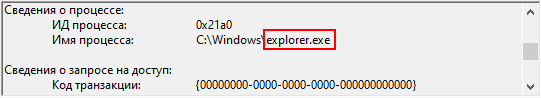
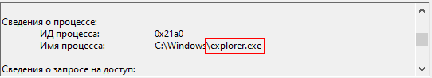

# 1. Для каких пользователей (логины и SID'ы) зарегистрированы события типа Audit Failure по доступу к файлу Share.txt?

### Ответ:

2 пользователя, 4 события.

# 2. Каковы ID событий (Event ID) и время, когда это было зафиксировано?

Event ID у всех событий одинаковый. Время у 3х событий одно, а у 4го события на 20 секунд раньше.

# 3. С помощью каких процессов (приложений) была осуществлена попытка доступа (в русскоязычной Windows Имя процесса)?

* Данным пользователем была осуществлена попытка доступа через процесс NotePad.exe

* Данным пользователем была осуществлена попытка доступа через процесс NotePad.exe и через Explorer.exe 

